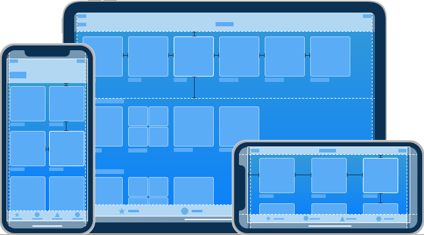

## iOS Human Interface Guidelines

## **Contents** 
- iOS
  - [Themes](#Themes)
  - [Interface Essentials](#interface-essentials)
- App Architecture
  - [Launching](#Launching)
  - [Onboarding](#Onboarding)
  - [Loading](#Loading)
  - [Modality](#Modality)
- User Interaction
- System Capabilities
- Visual Design
- Icons and Images
- Bars
- Views
- Controls
- Extensions

## Themes

### iOS Design Theme
당신은 디자이너로써 AppStore 인가차트에 선보일 놀라운 앱을 선보일 기회를 가지고 있다. 그러기 위해 당신은 품질과 기능에 대한 높은 기대치를 만족시켜야할 필요가 있다.

iOS의 3가지 차별성

* 명확성
  1. Text는 모든 크기에서 읽을 수 있어야 한다.
  2. icon은 정확하고 명쾌해야 한다.
  3. adornments는 정교하고 적절하게 사용해야 한다.
  4. 기능성에 기초한 디자인을 해야 한다.

* 차이점  
  아름다운 인터페이스는 사용자가 컨텐츠를 이해하고 상호작용하는데 도움을 준다. 일반적으로 컨텐츠는 화면을 가득 채우고 bezels, gradients, shadow(drop) 사용을 최소화해 인터페이스를 밝게 유지해야한다. **무엇보다도 가장 중요한 것은 컨텐츠입니다.**  

* 깊이  
  뚜렷한 시각적 계층과 현실적인 motion은 위계를 전달하고, 활력을 주며, 이해하기 쉽게 도와준다. 터치와 발견성은 즐거움을 높이고 기능과 추가 컨텐츠를 볼때 문맥을 잃지 않게 해준다. 화면 전환은 컨텐츠를 탐색할 때 깊이 있는 감각을 제공한다.
  ###

  
### Design Principles
앱의 독자성을 상상하면서 6가지 원칙을 기억하세요!
* #### 미적 무결성  
  미적 무결성은 앱의 기능이 앱 디자인과 흐름과 얼마나 잘 어울어지는지 낸다. 예를 들어, 중요한 작업을 수행하는 앱은 눈에 띄지 않는 그래픽, 예측 가능한 동작, 일반적인 컨트롤를 사용해 그들이 편안하게 앱을 사용하게 도와준다. 반면 게임과 같은 몰입형 앱은 새로운 동작을 통해서 재미와 흥미를 약속하며 매혹적인 모습을 전달 할 수 있다.

* #### 일관성  
  일관된 앱은 시스템이 제공하는 인터페이스 요소, 자주 사용하는 아이콘, 표준 텍스트 스타일, 통일된 용어를 사용해 보다 친숙한한  패러다임을 도입한다. 앱은 사용자가 기대하는 방식으로 기능과 흐름을 제공한다.

* #### 직접적인 조작  
  화면 컨텐츠의 직접적인 조작은 사용자를 사로잡고 이해하기 쉽게 도와준다. 사용자가 화면을 회전하거나 제스쳐를 사용해 화면 컨텐츠를 조작할 때 직접적인 조작을 경험한다.

* #### 피드백  
  내장된 Feedback 앱은 모든 사용자 행동에 대응해 피드백을 제공한다. 탭하면 반응형 요소들이 강조되고, 오래걸리는 작업의 상태를 진행 indicator에 표시하고, 애니메이션과 소리를 통해 결과를 분명하게 전달한다.

* #### 은유  
  사용자는 앱의 물체들이 친숙한 경험에 대한 은유일때 더 빨리 이해 할 수 있다. 사용자가 신체적으로 스크린과 상호작용을 하기에 iOS에서 은유는 더 잘 사용된다. 예를 들어, 사용자는 스위치를 토글하고, 슬라이더를 이동시켜 원하는 값을 스크롤하며 심지어 책과 잡지를 휙휙 넘겨보기도 한다.

* #### 사용자 제어  
  iOS에서 모든 통제는 사용자에 의해 이루어진다. 앱은 단지 사용방법에 대해 제안하거나 위험한 결과에 대해 경고 할 수 있지만, 대부분 앱이 의사결정을 대신하는 것은 피해야 한다. 최고의 앱은 사용자와 원하지 않는 결과를 피하는 것 사이에 균형을 찾아야 한다. 앱은 상호작용을 예측 가능하게 유지하며, 진행중인 행동을 쉽게 취소할 수 있게 만들어 사용자로 하여금 그들이 모든 것을 통제하는 것 처럼 느끼게 해야 한다.

## Interface Essentials

대부분의 iOS 앱은 UIKit을 사용해 개발한다. UIKit은 공통 인터페이스 요소를 정의하는 프레임워크이다. 이 프레임워크는 앱 시스템 전반에 걸쳐 일관된 시스템을 제공할 뿐만 아니라 높은 수준의 customization을 제공한다. UIKit 요소들은 친숙하고 유연하다. 단일 앱으로 모든 iOS 기기에서 훌륭한 디자인을 보여주고 외관 변경 시 자동으로 시스템이 업데이트한다. UIKit에서 제공하는 인터페이스 요소들은 3가지 메인 범주로 나뉜다.

[Bars.](#Bars) 사용자에게 앱에서 위치를 알려주거나 네비게이션 기능을 제공해야한다.
동작을 시작하거나 정보를 전달하는 버튼 등을 포함한다.

[Views.](#Views) 사람들이 보는 주요한 컨텐츠, 예를들어 텍스트, 그래픽 애니메이션 등을 포함해야 하며 스크롤, 삽입, 삭제, 재배열과 같은 기능들을 제공해야한다.

[Control.](#Controls) 기능을 제공하거나 정보를 전달해야 한다. 예를 들어 버튼, 스위치, 텍스트필드, 진행 상태바 등이 있다.

UIKit은 iOS 인터페이스를 정의할 뿐만 아니라 앱에서 채택할 수 있는 다양한 기능을 가지고 있다. UIKit을 통해 당신의 앱은 제스쳐를 인식하고 드로잉, 접근성, 프린팅 과 같은 기능들을 도입할 수 있다.

iOS는 애플페이, HealthKit, ReasearchKit와 같은 다른 프레임워크를 사용해 파워풀한 앱 디자인을 가능케한다.

## Launching
앱의 시작 경험은 앱 사용자들의 느낌에 상당한 영향을 끼친다. 사용자들이 사용하는 기기나 앱을 마지막으로 실행한지 얼마나 되었던 간에 앱의 시작은 빠르고 매끄럽게 진행되야 한다.

아래의 가이드라인은 마음에 드는 시작 경험을 디자인하는데 많은 도움을 줄 수 있다.

*Provide a launch screen.* 시스템은 앱을 시작하면 Launch 화면을 잠시 보여주고 빠르게 시작 화면으로 전환된다. Launch 화면의 기능은 사람들에게 초기 컨텐츠를 로딩하는데 얼마나 빠르고 반응적인지 알려준다. 매끄러운 화면 전환을 위해 사용자가 보기에 시작 화면과 비슷하고 일반적인 디자인으로 Luahch 화면을 구성해야한다.

*Launch in the appropriate orientation.* 가로모드 와 세로모드를 지원하면 기기의 현재 모드에 맞춰서 앱이 시작되어야 한다. 만약 한가지 모드만 지원한다면 항상 같은 방향으로 앱이 시작되어야 하며 사용자의 필요에 따라 기기 회전을 지원해야 한다. 특별한 이유가 없다면 가로모드는 기기가 좌우 회전 여부와 관계 없이 항상 가로모드를 유지해야 한다.

*Avoid asking for setup information up front.* 사용자는 앱이 바로 시작할 것을 기대한다. 대부분의 사용자들을 위한 앱을 설계하고 일부 다른 구성을 원하는 소수의 사용자만 자신의 입맛에 맞게 바꾸는 것을 지원해라. 가능하다면 디바이스 설정, 기본값, iCloud에서 초기 설정 정보를 가져와라. 앱 첫 시작시 초기 설정 정보를 필요로 한다면, 앱 설정에서 나중에 바꿀 수 있는 기능을 제공해야 한다.

*Avoid showing in-app licensing agreements and disclaimers.* 라이센스 동의 및 거부권을 App Store에 기재해 사용자가 다운받기 전에 읽을 수 있어야 한다. 반드시 앱에 포함되어야 한다면 사용자 경험을 방해하지 않는 방향으로 앱에 표시해야 한다.

*Restore the previous state when your app restarts.* 사용자가 앱에서 이전 위치로 이동하기 위해 되돌아 가게 하지 마라. 중단한 부분부터 계속할 수 있도록 앱의 상태를 유지하고 복원해야 한다.

*Don’t encourage rebooting.* 재시간은 오랜 시간이 걸리고 앱을 신뢰할 수 없고 사용하기 어렵게 만든다. 만약 메모리나 다른 이슈로 인해 시스템이 재시작된 상태에서만 실행 가능하다면 해당 문제는 반드시 해결해야 한다.

*Avoid asking people to rate your app too quickly or too often.* 평점 등록을 설치 후 너무 빨리, 자주 요청하는 것은 지양해라. 좋은 피드백을 얻기 위해 사용자에게 앱에 대한 의견을 생각해볼 시간을 줘야한다. 등록 요청을 거부할 수 있는 기능을 항상 제공하고 강요하지마라.

## Onboarding
Onboarding을 통해 새로운 사용자를 환영하고 다시 돌아온 사용자를 재연결 할 수 있다. 빠르고 즐거운 온보딩 경험은 사람들에게 전반적인 앱의 기능을 알려준다.

*사람들이 앱을 즐기는데 도움을 줄 수 있는 Onboarding을 제공하라.* 사용자는앱의 기능을 학습할 수 있는기회에 감사할 것이다. 사용자 환경 설정과 라이센스 정보 등을 Onboarding에서 피해라.  
자세한 내용은 [Launching](#Launching)을 참고하세요.

*빠르게 작업을 실행해라.* 앱의 초기화면이 시작되고, 바로 당신의 앱을 즐길수 있도록 해야한다. 만약 튜토리얼이나 인트로를 제공해야 한다면 사용자들이 스킵할 수 있는 선택을 제공하고 다시 돌아온 사용자에게 보여주지 마라.

*도움이 필요한 곳을 예측해라.* 사용자가 고전 할 수 있는 곳을 미리 찾아라. 예를 들어 게엠에서 정지 상태에서 유용한 팁을 보여줘라. 사용자가 무언가 놓쳤을 상황을 위해 튜토리얼을 제시작 할 수 있는 기회를 제공해라.

*꼭 필요한 것만 튜토리얼에 포함해라.* 초보자를 위한 가이드라인을 제공하는 것은 좋지만 가이드라인이 필요하지 않는 훌륭한 디자인을 제공해라. 우선, 직관적이게 디자인해라. 많은 가이드라인이 필요하다면, 앱의 디자인을 다시 확인해야한다.

*학습을 재밌고 발견 가능하게 해라.* 행동을 통해서 배우는 것이 지시사항을 읽는 것 보다 훨씬 즐겁고 효과적이다. 애니메이션과 상호작용을 사용해 상황에 맞게 점진적으로 가르쳐라. 상호작용에 의한 스크린샷을 보여주는 것은 피해라.

## Loading
컨텐츠 로딩시 빈 화면, 움직임이 없는 화면은 앱이 멈춰보여 사용자에게 혼란과 불편함을 야기시키고 사용자가 앱을 떠날 수 있다.

*로딩 중을 명확히 알려라.* 최소한 무언가 처리중이라는 인디케이터를 표시해라. 진행 현황을 표시해 사용자가 얼마나 더 기다려야하는지 표시하면 더 좋다.

*콘텐츠를 최대한 빨리 표시해라.* 사용자가 컨텐츠를 기다리게 하지 마라. 화면을 즉시 표시하고 아직 표시되지 않은 텍스트, 그래픽, 애니메이션에 placeholder를 사용해라. 사용자가 애니메이션을 재생하거나 메뉴를 탐색하는 동안 미리 다음 컨텐츠를 로딩해라.

*로딩시간을 정보를 전달, 흥미로운 시간으로 감춰라.* 예를 들어 게임에 대한 힌트를 제공하거나, 재미있는 비디오 등을 고려해라.

*로딩 화면을 custimize 해라.* 진행바를 사용하는 것도 좋지만 상황에 맞지 않을 때도 있다. 앱과 어울리는 애니메이션, 요소를 사용해 몰입감 있는 경험을 디자인해라.
자세한 내용은 [Progress Indicators](#Progress_Indicators)을 참고하세요.

## Modality
Modality는 사용자의 이전 문맥과 별도로 컨텐츠를 일시적으로 표시하는 디자인 기법 중 하나이며 종료하려면 분명한 작업이 필요하다. 컨텐츠를 modally하게 보여주면 다음과 같은 장점이 있다.

* 사용자가 연관성이 높은 옵션, 자급자족하는 작업에 더 집중할 수 있도록 도와준다.
* 사용자가 중요한 정보를 수신하고 필요한 경우 조취를 취할 수 있도록 보장한다.

iOS는 Alert 뷰, Activity 뷰, Action 시트를 제공하며 필요한 상황에 맞게 사용할 수 있다. 커스텀 Modal 컨텐츠를 제공하기 위해 iOS 13 이후로 다음과 같은 표현 스타일을 따라야 한다.

#### Sheet
Sheet 표현 스타일은 기존 컨텐츠를 부분적으로 가리는 *카드*로 나타나며 가려지지 않은 영역과의 상호작용을 방지하고자 흐리게 처리한다. 현재 카드 상단에 이전 화면의 위쪽 가장자리를 표시해 사용자가 기존에 중단한 작업을 기억할 수 있도록 도와준다.  
카드를 버리는 방법:
* 카드 상단 가장자리에서 아래로 스와이프
* 카드의 컨텐츠를 상단으로 스크롤시 아래로 스와이프
* 버튼 탭

복잡한 일을 하지 않는 Modal 컨텐츠에 사용해라.

#### Fullscreen
풀스크린 표현 스타일은 모든 화면을 덮어 씌운다. 기존 화면을 완벽하게 가려지고 시각적 산만함을 최소화 한다. 사용자는 버튼을 탭해 풀스크린 Modal 뷰를 종료할 수 있다.

몰입적인 콘텐츠를 보여줄 때 풀스크린을 사용해라. 예를 들어 비디오, 사진, 사진수정, 카메라뷰, 풀스크린으로 이득을 볼 수 있는 복잡한 것이 있다.

*꼭 필요한 경우에만 Modality를 사용해라.* 선택을 해야하거나 기존과 다른 임무를 처리해하는 일에 사용자의 주의를 집중시켜야 할때 modal을 사용해라. modal 경험은 기존 컨텍스트에서 벗어나며 modal 화면을 버리기위에 별도의 행동을 필요로 하기에 분명한 이득이 있을때만 사용해야 한다.

*필수적인 것을 전달하거나 실행 가능한 정보를 전달하는 경고를 예약해야 한다.* 일반적으로 경고는 잘못 됐을때 나타난다. 경고는 기존 경험을 방해하고 종료 버튼을 요구하기에 사용자가 침입이 정당하다고 느끼게 하는 것이 중요하다. 자세한 내용은 [Alerts](#Alerts)을 참고하세요.

*modal 작업은 단순하고 짧고 좁게 집중되야 한다.* 앱안에 앱을 만드는 것은 피해라. modal 작업이 복잡하면 사용자가 modal 작업전에 중지되었던 작업에 대해 잊을 수 있다. 특히 여러 화면으로 구성된 modal 작업을 만들때 주의해야 한다. 사용자가 길을 잃을 수 있고 어떻게 돌아가야할지 모를 수 있다. 반드시 modal 작업이 하위 화면을 포함해야 한다면 단일경로와 명확한 경로를 제공해라. 작업완료 이외에 Done 버튼을 사용하지 마라.

*modal 작업을 벗어날 수 있는 버튼을 항상 제공해라.* 예를 들어 Done, Cancel을 사용할 수 있다. 버튼을 제공하면 보조 기술에서 modal 화면에 접근 할 수 있고 벗어 날수 잇는 제스쳐를 제공한다

*사용자가 modal 화면을 닫기전에 데이터 손실을 방지할 수 있도록 도와라.* 사용자가 화면을 닫기위해 종료버튼을 누르거나 제스쳐를 취했더라도 작성한 내용이 손실 될 수 있는 작업인 경우 상황을 설명하고 해결할 수있는 방법을 제공한다.

*popover 화면에 카드를 표시하지 마라.* 카드에 popover 화면을 표시할 수 있지만 popover 화면 위에는 어떤 것도 있어선 안된다(경고 제외) 매우 드물지만 popover 작업 후 카드 를 표시해야한다면 열기전에 닫아야 한다.

*일반적으로 modal 작업에 이름을 표시해라.* 사용자가 modal 작업을 시작하면 기존 작업으로 부터 벗어난다. 그러므로 새로운 맥락을 분명히 표시하면 좋다. 텍스트를 제공해 현재 작업에 대해 완벽하게 설명하거나 가이드를 제공한다.

*앱의 배경에 맞게 modal 화면을 조정해라.* 예를 들어 modal 작업이 네비게이션 바를 포함한다면 앱의 네비게이션 디자인과 동일한 모습을 제공해야 한다.

*상황에 맞는 modal 트렌지션을 사용해라.* 앱에 맞춰서 트렌지션 스타일을 사용해라. 일시적인 문맥 변화에 대한 인식을 높일 수 있다. 디폴트 트렌지션을 화면 하단에서 세로로 올라오고 닫으면 아래로 다시 내려간다. 앱 내에서 일관적인 트렌지션을 사용해야 한다.

개발자를 위한 자세한 내용은 [UIViewController](#UIViewController), [UIPresentationController.](#UIPresentationController.)을 참고하세요.